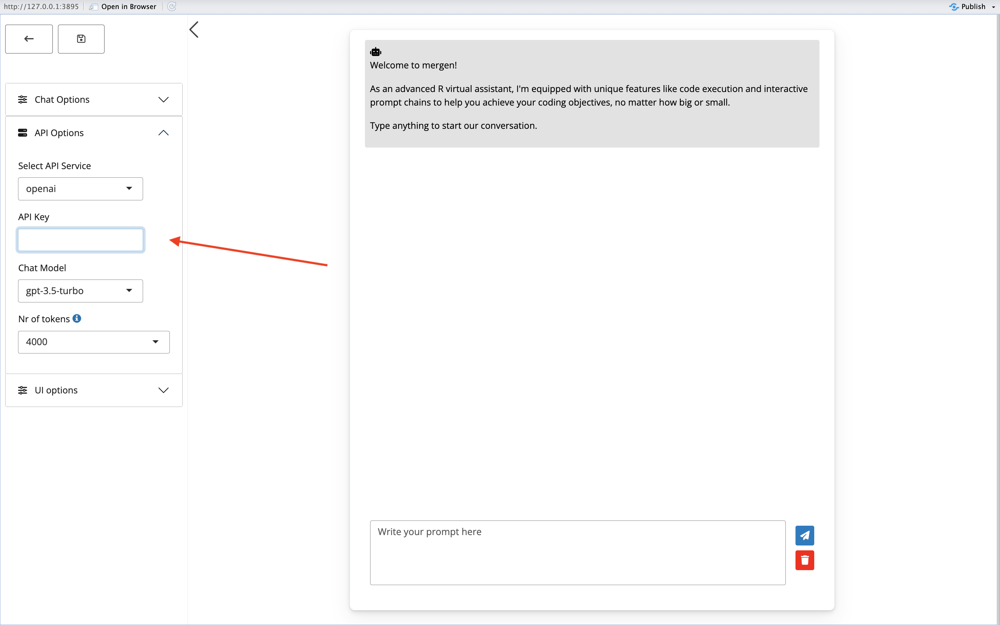
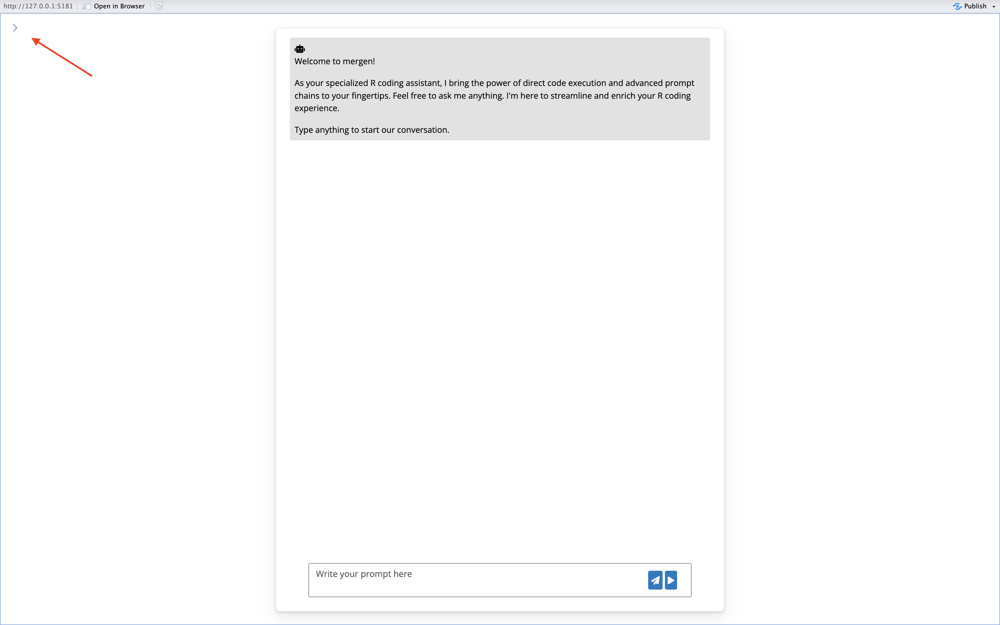
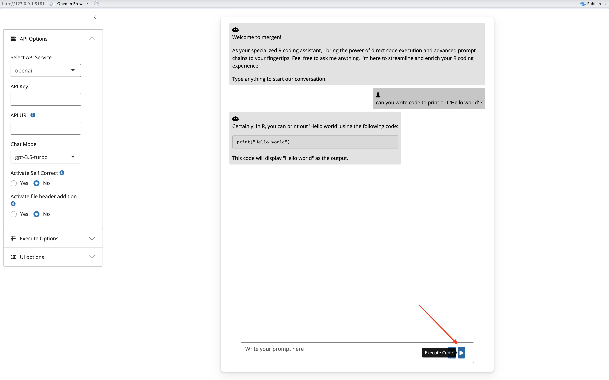
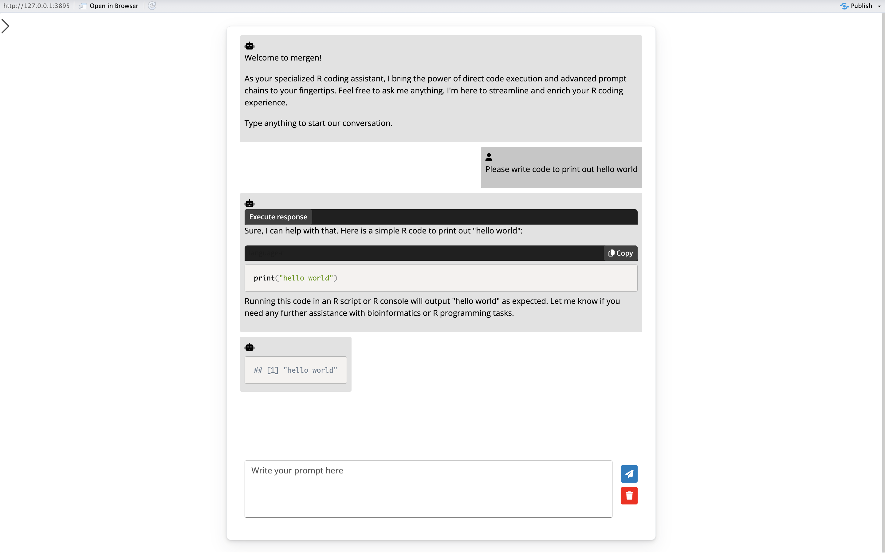
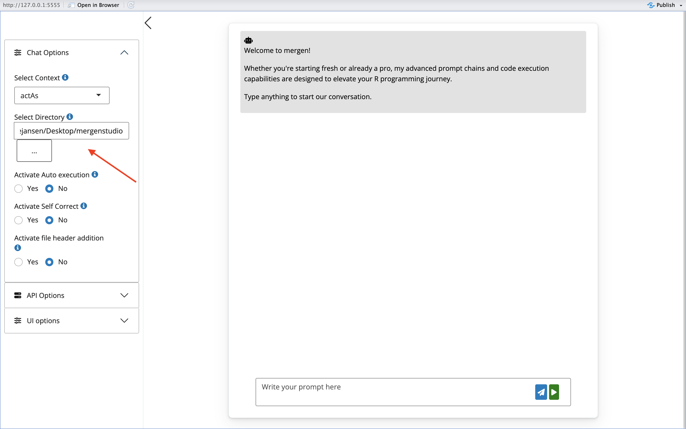

# mergen Studio 

<!-- README.md is generated from README.Rmd. Please edit that file -->


mergen Studio is an RStudio Addin wrapper for the
[mergen](https://github.com/BIMSBbioinfo/mergen) package.

You can find more information on mergen can be found on its website:  
<https://bioinformatics.mdc-berlin.de/mergen/>

## Installation

Install from the GitHub repository using devtools (with R version 4.0.0
or higher):

``` r
if (!require("devtools", quietly = TRUE))
    install.packages("devtools")
devtools::install_github("BIMSBbioinfo/mergenstudio")
```

#### Configuring your AI API key

To interact with an AI API, you require a valid AI API key. To configure
your key so that it is present globally in your environment at all
times, you can include it in your .Renviron file. This will ensure that
the key is automatically loaded.

For setting up mergen Studio, this variable should be called
`AI_API_KEY`.

**Caution:** If you’re using version control systems like GitHub,
include .Renviron in your .gitignore file to prevent exposing your
personal API key.

Here is how to open your .Renviron file for modification in your
project:

``` r
require(usethis)

edit_r_environ(scope="project")
```

For a persistent loading of your API key, add the following line to your
.Renviron file replacing `"your_key"` with your key.

``` r
AI_API_KEY="your_key"
```

**NOTE:** After setting up your API key in the .Renviron file, either
restart the R session or run `readRenviron(".Renviron")` to apply the
changes.

If you however wish to set this variable only for a single session, you
can use the following command:

``` r
Sys.setenv(AI_API_KEY="your_key")
```

mergen Studio also allows you to set your key once in the app interface.
Simply paste your key into the API key box on the side panel.



## Running mergen Studio

To run mergen Studio, open an R session and type in the following
command:

``` r
mergenstudio::run_chat_app()
```

This will open the chat interface. Press the arrow on the top left of
the screen to open the sidebar.

After this, you can choose which API service to use, and change/load in
your API key if needed. When making use of `openai` or `replicate` API
services, all that is needed is then to select a model to chat with, and
start chatting!

When setting the API service to `generic`, you are required to fill in
an `API URL` and  
fill in the chat model you wish to use by pasting in the name of the
model you wish to use into the `Chat Model` box. Please make sure that
chat model and API URL are filled in correctly. Usually you can find
more information about the API URL and model name syntax on the website
of your API service of choice.

## code execution

Once you have started chatting with your LLM of choice, any code that
might be generated by the LLM can be run directly in the chat interface.
To try and run code from a response, simply press the play button on the
right side of the chat box. This will run the code, and show you the
output.




## Advanced settings

In mergen Studio it is possible to make use of some more advanced
settings to alter the prompting strategy and improve responses. These
advanced settings include `Activate self correct` and
`Activate file header addition`

### Activate self correct

Activating Self Correct will attempt to correct code that is returned by
the agent if it results in errors, by resending the prompt together with
additional information about the error message. To make use of this
feature, you can change the setting to `Yes`.

### Activate file header addition

Activating file header addition will attempt to add the first few lines
of files mentioned in your prompt (if there are any) to your prompt. To
make use of this feature, you can change the setting to `Yes`. The
directory that will used to search for your files can be set in
`Execute options`.


