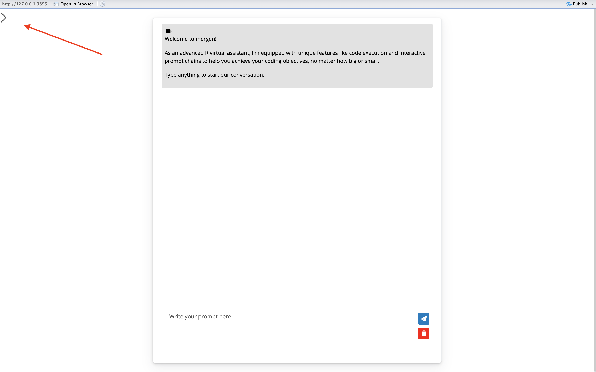
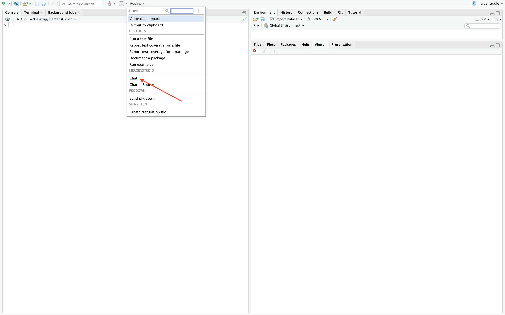
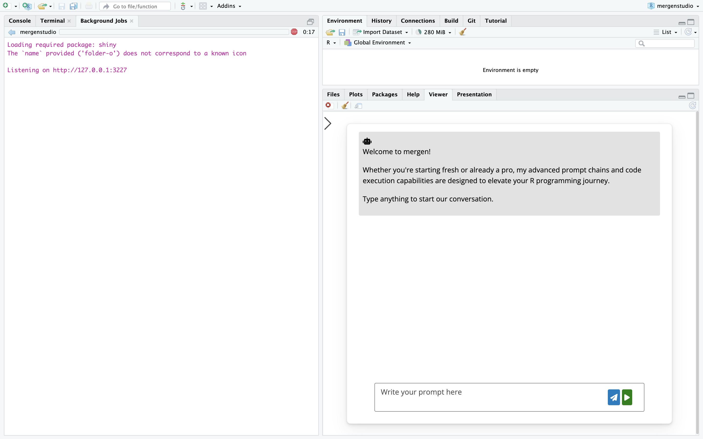
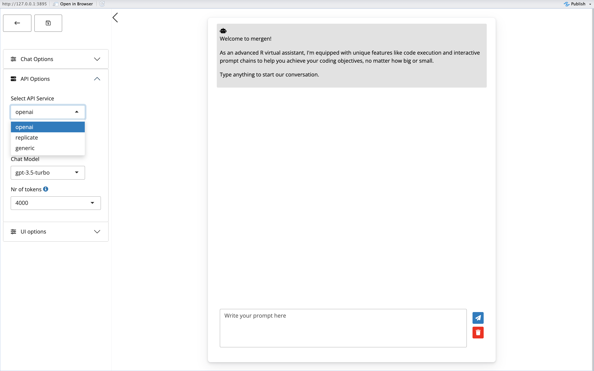
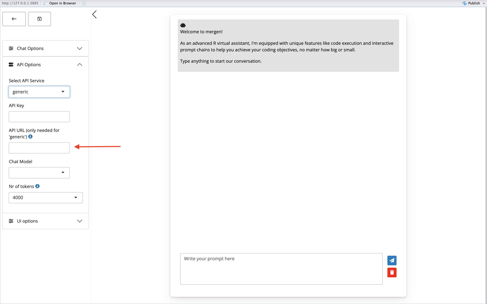
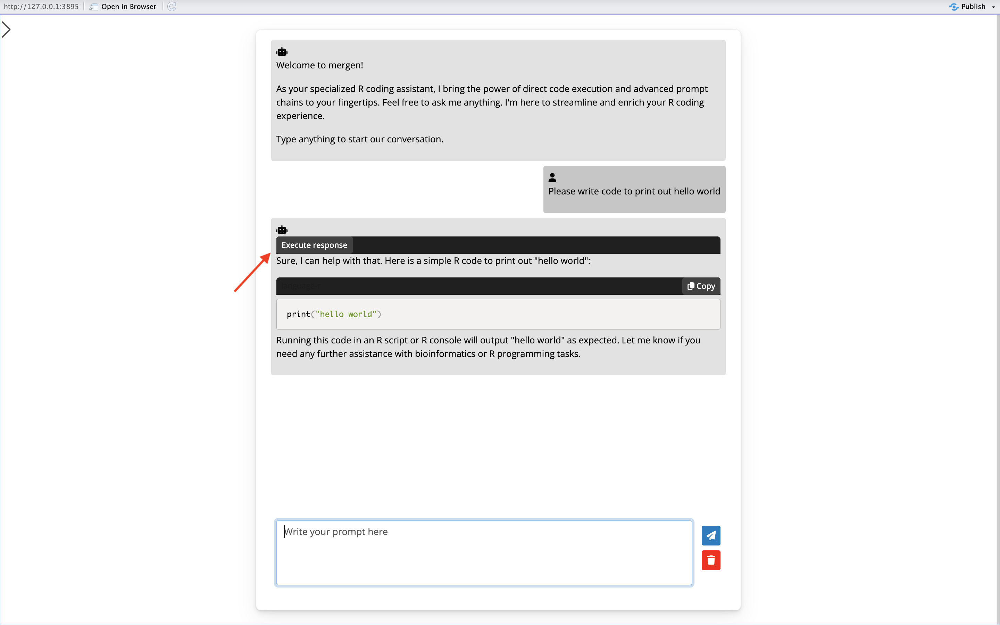
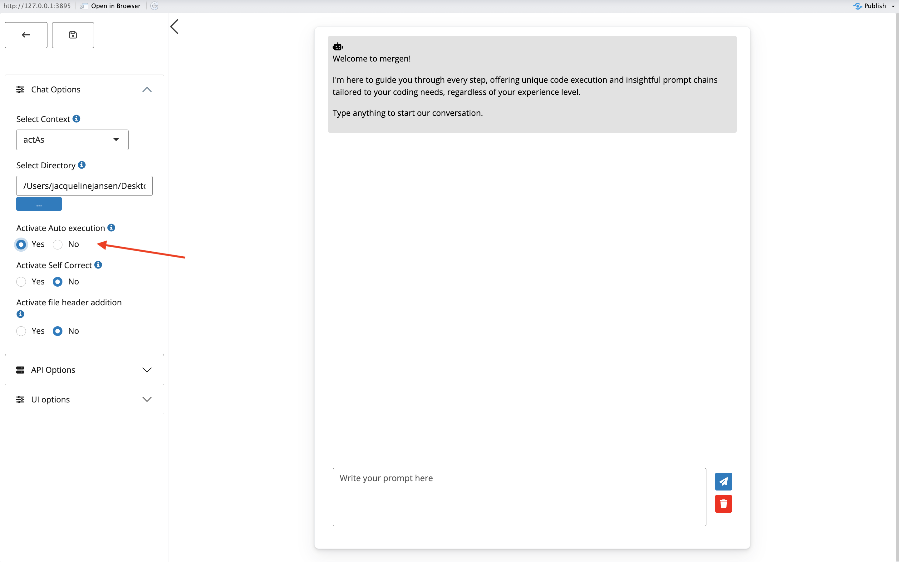
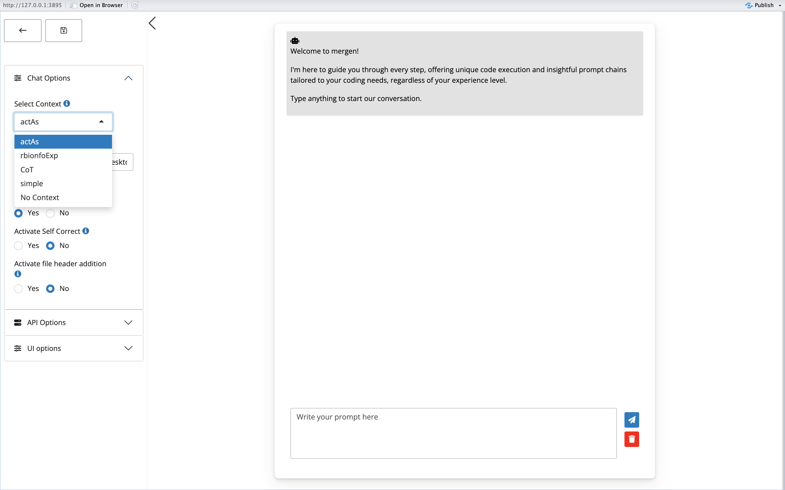
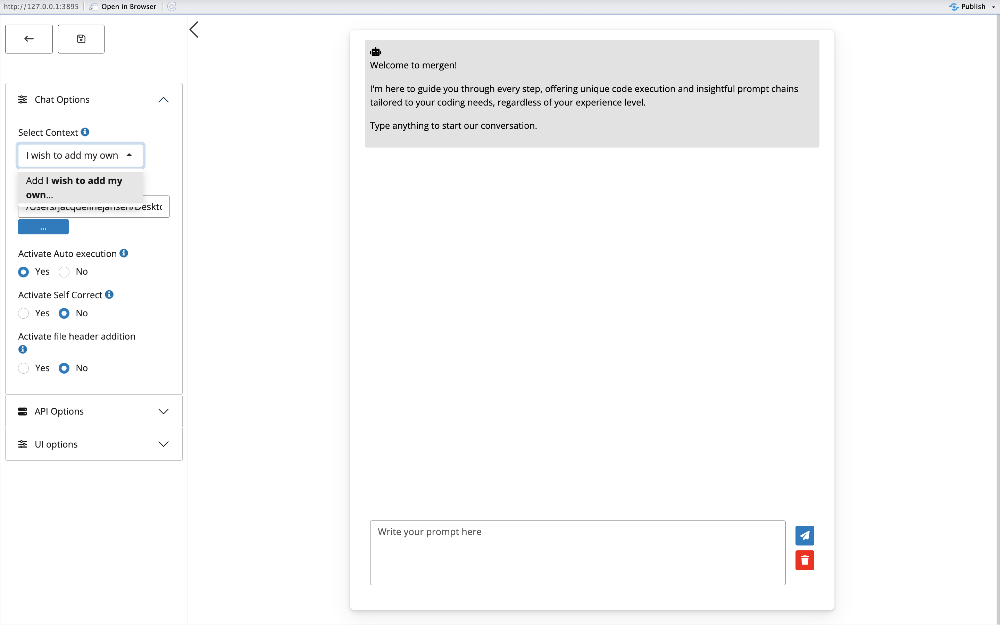

# mergen Studio 

<!-- README.md is generated from README.Rmd. Please edit that file -->

mergen Studio is an RStudio Addin wrapper for the
[mergen](https://github.com/BIMSBbioinfo/mergen) package.

You can find more information on mergen can be found on its website:  
<https://bioinformatics.mdc-berlin.de/mergen/>

## Installation

Install from the GitHub repository using devtools (with R version 4.0.0
or higher):

``` r
if (!require("devtools", quietly = TRUE))
    install.packages("devtools")
devtools::install_github("BIMSBbioinfo/mergenstudio")
```

#### Configuring your AI API key

To interact with an AI API, you require a valid AI API key. To configure
your key so that it is present globally in your environment at all
times, you can include it in your .Renviron file. This will ensure that
the key is automatically loaded.

For setting up mergen Studio, this variable should be called
`AI_API_KEY`.

**Caution:** If you’re using version control systems like GitHub,
include .Renviron in your .gitignore file to prevent exposing your
personal API key.

Here is how to open your .Renviron file for modification in your
project:

``` r
require(usethis)

edit_r_environ(scope="project")
```

For a persistent loading of your API key, add the following line to your
.Renviron file replacing `"your_key"` with your key.

``` r
AI_API_KEY="your_key"
```

**NOTE:** After setting up your API key in the .Renviron file, either
restart the R session or run `readRenviron(".Renviron")` to apply the
changes.

If you however wish to set this variable only for a single session, you
can use the following command:

``` r
Sys.setenv(AI_API_KEY="your_key")
```

mergen Studio also allows you to set your key once in the app interface.
Simply paste your key into the API key box on the side panel under API
options.


## Running mergen Studio

To run mergen Studio, open an R session and type in the following
command:

``` r
mergenstudio::run_chat_app()
```

This will open the chat interface. Press the arrow on the top left of
the screen to open the sidebar.

After this, you can choose which API service to use, and change/load in
your API key if needed. This can be done in the API options menu.

When using Rstudio, mergen Studio also allows you to open the chat
interface in the Viewer. To do this, press on the Addins button, and
select `Chat`.



When making use of `openai` or `replicate` API services, after setting
your API key, all that is needed is to select a model to chat with, and
start chatting!

When setting the API service to `generic`, you are required to fill in
an `API URL` and  
fill in the chat model you wish to use by pasting in the name of the
model you wish to use into the `Chat Model` box. Please make sure that
chat model and API URL are filled in correctly. Usually you can find
more information about the API URL and model name syntax on the website
of your API service of choice.




## Saving default settings

In the video below, we show you how to open a chat via mergenstudio, and
save some default settings which will persist for subsequent chat
sessions.

<video height="800" width="800" controls>
<source src="man/figures/Saving API key.mp4" type="video/mp4">
</video>

## code execution

Once you have started chatting with your LLM of choice, any code that
might be generated by the LLM can be run directly in the chat interface.
To run code from a response, simply press the ‘execute code’ button on
top of the response. This will run the code, and show you the output.




To automatically run any code without having to press the `execute code`
button, turn on the option `Activate auto execution` from the
`Chat options` panel.



Below you can find a video tutorial on how mergenstudio can be used to
read in data from a file, and run code on it.

<video height="800" width="800" controls>
<source src="man/figures/autoex.mp4" type="video/mp4">
</video>

## Advanced settings

In mergen Studio it is possible to make use of some more advanced
settings to alter the prompting strategy and improve responses. These
advanced settings include `Select context`, `Activate self correct` and
`Activate file header addition`

### Select context

Selecting a context allows you to send a specific context with every
question that is sent to the LLM, as a way of prompt engineering. Mergen
contains the following predefined contexts: Simple, ActAs,rbionfoExp and
CoT. Users can also send their own context by simply typing into the box
and clicking add. This will add the user context to the list of possible
contexts to choose from (see pictures below). If you wish to not send
any context to the prompt at all, you can select `No context`. This is
not recommended however, since the LLM then might provide code examples
in languages other then R.




### Activate self correct

Activating Self Correct will attempt to correct code that is returned by
the agent if it results in errors, by resending the prompt together with
additional information about the error message. To make use of this
feature, you can change the setting to `Yes`. Activating self-correct
can also be done after an error message is received. Below you can find
a video on how mergenstudio can be used to perform complex data analysis
tasks and also can be used to correct for errors in the code.

<video height="800" width="800" controls>
<source src="man/figures/heatmaps.mp4" type="video/mp4">
</video>

### Activate file header addition

Activating file header addition will attempt to add the first few lines
of files mentioned in your prompt (if there are any) to your prompt. To
make use of this feature, you can change the setting to `Yes`. The
directory that will used to search for your files can be set under
`Chat options` `Select directory`. Below you can find a video tutorial
on how file header addition works:

<video height="800" width="800" controls>
<source src="man/figures/adding file headers.mov" type="video/mp4">
</video>
